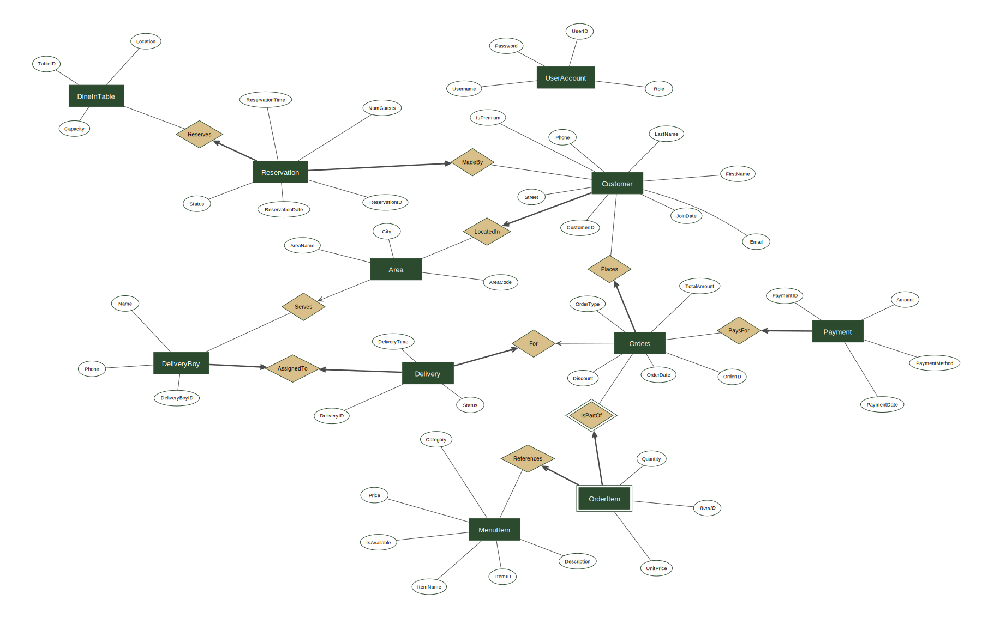

# Restaurant Management Database System

A normalized PostgreSQL database for a restaurant — customers, menu items, orders, deliveries, payments, reservations, and staff accounts — with a documented BCNF design, analytical queries, business-rule triggers, and views.

*Originally developed as a two-person university database project.*

## Tech Stack

- **Database:** PostgreSQL 14+
- **SQL:** constraints (PK / FK / CHECK / UNIQUE / NOT NULL), two views, three `PL/pgSQL` triggers, and ten analytical queries

## Highlights

The schema is 11 tables normalized to BCNF, with a per-table functional-dependency analysis documented in [docs/DESIGN.md](docs/DESIGN.md). Menu data is real (32 items from the Maven Analytics Restaurant Orders dataset); the beverages, customers, orders, and deliveries are synthetic. The SQL layer includes 10 analytical queries (multi-table joins, GROUP BY aggregation, `INTERSECT`/`EXCEPT` set operations, and relational division via `NOT EXISTS`), plus two views (`CustomerOrderSummary`, `OrderDetails`) and three triggers enforcing cross-table rules: blocking deliveries on Dine-In orders, auto-promoting customers to premium at $200 lifetime spend, and blocking deletion of customers who still have orders.

## Entity-Relationship Diagram



## Repository Layout

```
├── docs/
│   ├── DESIGN.md               Full design and implementation walkthrough
│   ├── erd.svg                 Entity-relationship diagram
│   └── screenshots/
│       └── views/              View result screenshots
└── sql/
    ├── schema.sql              CREATE TABLE with PK / FK / CHECK / UNIQUE / NOT NULL
    ├── seed.sql                Real + synthetic data (~245 rows across 11 tables)
    ├── views.sql               CustomerOrderSummary, OrderDetails
    ├── triggers.sql            Three business-rule triggers
    └── queries.sql             Ten analytical queries
```

## Running It Locally

### 1. Load the database

```bash
createdb restaurant_db
psql -d restaurant_db -f sql/schema.sql
psql -d restaurant_db -f sql/triggers.sql   # before seed, so the premium-promotion trigger fires as orders load
psql -d restaurant_db -f sql/views.sql
psql -d restaurant_db -f sql/seed.sql
```

### 2. Explore the database

```bash
psql -d restaurant_db -f sql/queries.sql     # runs all 10 analytical queries with their output
psql -d restaurant_db -c "\d+ orders"        # inspect a table: columns, types, constraints
psql -d restaurant_db -c "SELECT CustomerID, IsPremium FROM Customer WHERE CustomerID = 7;"
                                             # James Wilson shows 'Yes' — promoted by the premium trigger
```

## Design Doc

For the full walkthrough — domain model, schema design, BCNF analysis, views, triggers, and sample queries — see **[docs/DESIGN.md](docs/DESIGN.md)**.

## Data Source

Menu items (IDs 101–132) come from the [Maven Analytics Restaurant Orders dataset](https://github.com/zainhaidar16/Restaurant-Order-Analysis). Beverage items (IDs 133–138) and all other table data are synthetic and generated to exercise the schema.

## License

Released under the [MIT License](LICENSE).
