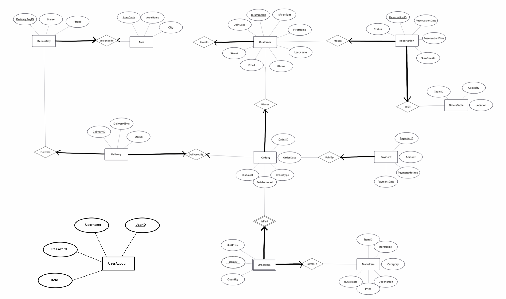
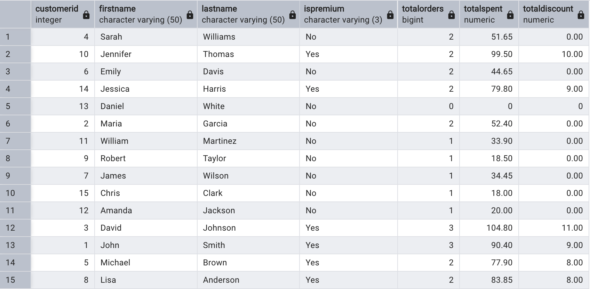
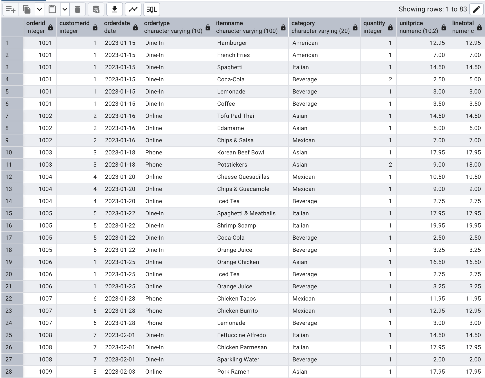
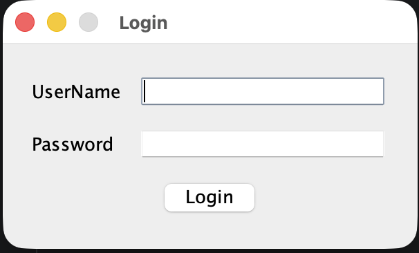
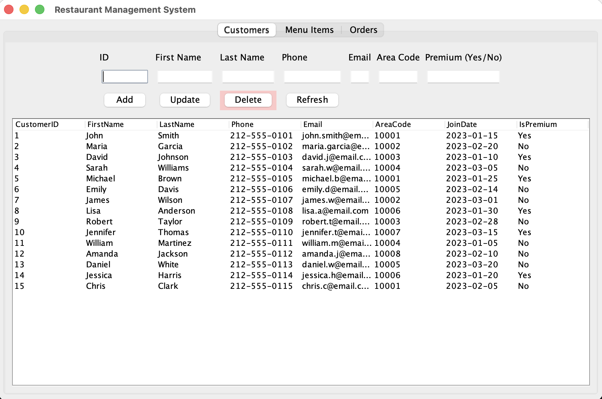
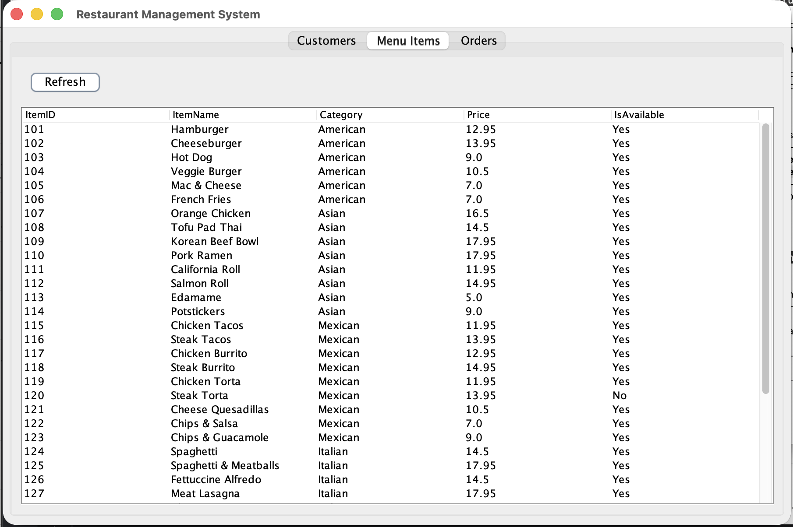
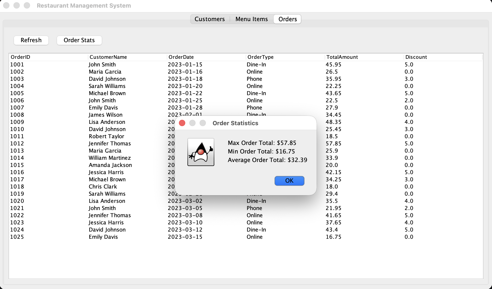

# Design & Implementation

This document covers the data model, schema, SQL, and GUI behind the Restaurant Management Database System.

---

## 1. Domain Overview

The system models a restaurant that supports both in-house dining and remote ordering (online and phone). It tracks:

- A menu catalog of food and beverage items across multiple cuisine categories
- Customer records with a premium-status flag used for discount eligibility
- Orders across three channels — Dine-In, Online, and Phone — along with the individual line items in each
- Deliveries, assigned to delivery personnel responsible for specific area codes
- Dine-in table reservations
- Payment transactions across cash, credit card, debit card, and online methods

---

## 2. Entities and Relationships

The system is built around ten business entities plus a separate table for GUI authentication:

| Entity | Purpose |
|---|---|
| **Area** | Geographic delivery zones, identified by area code |
| **Customer** | Patrons with contact info, join date, and premium flag |
| **MenuItem** | Menu catalog with name, cuisine category, price, and availability |
| **DineInTable** | Physical tables with seating capacity and location |
| **DeliveryBoy** | Delivery personnel, each assigned to exactly one area |
| **Orders** | A customer's order, recording date, type, total, and discount |
| **OrderItem** | Line items linking orders to menu items (weak entity) |
| **Delivery** | Delivery record for online/phone orders |
| **Payment** | Payment transactions, one per order |
| **Reservation** | Dine-in table reservations with date, time, and party size |
| **UserAccount** | Role-based login for the Swing application |

Key design decisions:

- **One-to-one between DeliveryBoy and Area.** A `UNIQUE` constraint on `DeliveryBoy.AreaCode` enforces the rule that each area has at most one delivery driver, making driver assignment deterministic.
- **OrderItem as a weak entity.** Orders and menu items have a many-to-many relationship, so `OrderItem` resolves it with a composite primary key `(OrderID, ItemID)` plus `Quantity` and `UnitPrice` attributes. Deletion of an order cascades to its line items so no orphans can exist.
- **`UnitPrice` as a historical snapshot.** `OrderItem.UnitPrice` is captured at order time, not looked up from `MenuItem.Price`. When the restaurant raises a price, historical orders preserve what the customer was actually charged.
- **Participation constraints.** Every order must belong to a registered customer, every payment must belong to an order, and every delivery must be assigned to a delivery driver — enforced by `NOT NULL` foreign keys.

### ERD



---

## 3. Relational Schema

The eleven tables use `INT` primary keys, `VARCHAR` for free-text fields, `DECIMAL(10,2)` for monetary values, and `DATE` / `TIMESTAMP` / `TIME` for temporal fields. Every constrained text column (order type, payment method, delivery status, menu category) uses a `CHECK` constraint against an explicit domain to prevent bad data at the storage layer.

```
Area(AreaCode PK, AreaName, City)
Customer(CustomerID PK, FirstName, LastName, Phone, Email UNIQUE, Street,
         AreaCode FK -> Area, JoinDate, IsPremium)
MenuItem(ItemID PK, ItemName,
         Category ∈ {American, Asian, Mexican, Italian, Beverage},
         Description, Price > 0, IsAvailable)
DineInTable(TableID PK, Capacity > 0, Location)
DeliveryBoy(DeliveryBoyID PK, Name, Phone, AreaCode FK UNIQUE)
Orders(OrderID PK, CustomerID FK, OrderDate,
       OrderType ∈ {Dine-In, Online, Phone}, TotalAmount, Discount)
OrderItem(OrderID, ItemID, Quantity > 0, UnitPrice > 0)  PK(OrderID, ItemID)
Delivery(DeliveryID PK, OrderID FK UNIQUE, DeliveryBoyID FK, DeliveryTime,
         Status ∈ {Pending, In Transit, Delivered, Cancelled})
Payment(PaymentID PK, OrderID FK UNIQUE, Amount > 0,
        PaymentMethod ∈ {Cash, Credit Card, Debit Card, Online}, PaymentDate)
Reservation(ReservationID PK, CustomerID FK, TableID FK,
            ReservationDate, ReservationTime, NumGuests > 0,
            Status ∈ {Confirmed, Cancelled, Completed})
UserAccount(UserID PK, Username UNIQUE, Password, Role)
```

The full DDL with all foreign keys, `NOT NULL`, and `CHECK` constraints lives in [`sql/schema.sql`](../sql/schema.sql).

### Normalization

All eleven tables are in **BCNF**. Each table has a clear primary key that determines every non-key attribute, and no table contains a non-trivial functional dependency whose left-hand side is not a superkey. A few cases are worth calling out:

- **DeliveryBoy has two candidate keys** — `{DeliveryBoyID}` and `{AreaCode}` (due to the one-to-one relationship with Area). Both functional dependencies are on superkeys, so BCNF holds.
- **OrderItem has a composite candidate key** `{OrderID, ItemID}`. One could ask whether `ItemID -> UnitPrice` holds, since `UnitPrice` often matches the menu item's current price — it does not. `UnitPrice` is a historical snapshot, so the same `ItemID` can legally carry different `UnitPrice` values across orders.
- **Orders stores `TotalAmount` as a denormalized aggregate** — it could be derived from `SUM(Quantity * UnitPrice) - Discount` across its line items. This is a deliberate trade-off: storing the total avoids recomputing it on every read, at the cost of having to keep it consistent at the application layer.
- **Reservation has an alternate candidate key** `{TableID, ReservationDate, ReservationTime}` — a single table cannot be double-booked at the same time.

---

## 4. Views

Two views encapsulate frequently-needed joins. Full definitions live in [`sql/views.sql`](../sql/views.sql).

### CustomerOrderSummary

One row per customer with total orders, total spending, and total discounts received. Uses a `LEFT JOIN` so customers with zero orders still appear with counts of zero.

```sql
CREATE VIEW CustomerOrderSummary AS
SELECT
    C.CustomerID, C.FirstName, C.LastName, C.IsPremium,
    COUNT(O.OrderID)                  AS TotalOrders,
    COALESCE(SUM(O.TotalAmount), 0)   AS TotalSpent,
    COALESCE(SUM(O.Discount), 0)      AS TotalDiscount
FROM Customer C
LEFT JOIN Orders O ON C.CustomerID = O.CustomerID
GROUP BY C.CustomerID, C.FirstName, C.LastName, C.IsPremium;
```

This is what the GUI's aggregate queries run against — e.g., `SELECT MAX(TotalSpent), MIN(TotalSpent), AVG(TotalSpent) FROM CustomerOrderSummary`.



### OrderDetails

Flattens the three-way join between `Orders`, `OrderItem`, and `MenuItem` into a single row per line item, with a computed `LineTotal` column.

```sql
CREATE VIEW OrderDetails AS
SELECT
    O.OrderID, O.CustomerID, O.OrderDate, O.OrderType,
    M.ItemName, M.Category,
    OI.Quantity, OI.UnitPrice,
    (OI.Quantity * OI.UnitPrice) AS LineTotal
FROM Orders O
JOIN OrderItem OI ON O.OrderID = OI.OrderID
JOIN MenuItem  M  ON OI.ItemID  = M.ItemID;
```

Simplifies item-level sales reporting and the GUI's keyword search.



---

## 5. Triggers

Three triggers enforce cross-table business rules that can't be expressed with simple `CHECK` constraints. Full definitions live in [`sql/triggers.sql`](../sql/triggers.sql).

### Block deliveries for Dine-In orders — `BEFORE INSERT ON Delivery`

```sql
CREATE OR REPLACE FUNCTION fn_prevent_dinein_delivery()
RETURNS TRIGGER AS $$
BEGIN
    IF EXISTS (
        SELECT 1 FROM Orders O
        WHERE O.OrderID = NEW.OrderID AND O.OrderType = 'Dine-In'
    ) THEN
        RAISE EXCEPTION 'Cannot create a delivery for a Dine-In order.';
    END IF;
    RETURN NEW;
END;
$$ LANGUAGE plpgsql;
```

### Auto-promote to premium at $200 lifetime spend — `AFTER UPDATE ON Orders`

```sql
CREATE OR REPLACE FUNCTION fn_update_premium_status()
RETURNS TRIGGER AS $$
BEGIN
    UPDATE Customer
    SET IsPremium = 'Yes'
    WHERE CustomerID IN (
        SELECT O.CustomerID FROM Orders O
        GROUP BY O.CustomerID
        HAVING SUM(O.TotalAmount) >= 200
    )
    AND IsPremium = 'No';
    RETURN NEW;
END;
$$ LANGUAGE plpgsql;
```

The `AND IsPremium = 'No'` guard avoids redundant writes when the customer is already premium.

### Block deletion of customers with orders — `BEFORE DELETE ON Customer`

```sql
CREATE OR REPLACE FUNCTION fn_prevent_customer_delete()
RETURNS TRIGGER AS $$
BEGIN
    IF EXISTS (
        SELECT 1 FROM Orders O WHERE O.CustomerID = OLD.CustomerID
    ) THEN
        RAISE EXCEPTION 'Cannot delete a customer who has existing orders.';
    END IF;
    RETURN OLD;
END;
$$ LANGUAGE plpgsql;
```

Preserves order history and prevents accidental referential data loss.

---

## 6. Sample Queries

Ten representative queries against the schema, ranging from simple filters to relational division. All ten live in [`sql/queries.sql`](../sql/queries.sql).

### Customers who placed both online and phone orders — set intersection

```sql
SELECT C.FirstName, C.LastName
FROM Customer C
JOIN Orders O ON C.CustomerID = O.CustomerID
WHERE O.OrderType = 'Online'
INTERSECT
SELECT C.FirstName, C.LastName
FROM Customer C
JOIN Orders O ON C.CustomerID = O.CustomerID
WHERE O.OrderType = 'Phone';
```

### Customers who have ordered every beverage on the menu — relational division

```sql
SELECT C.FirstName, C.LastName
FROM Customer C
WHERE NOT EXISTS (
    SELECT M.ItemID FROM MenuItem M
    WHERE M.Category = 'Beverage'
    EXCEPT
    SELECT OI.ItemID
    FROM Orders O
    JOIN OrderItem OI ON O.OrderID = OI.OrderID
    WHERE O.CustomerID = C.CustomerID
);
```

Implements relational division via `NOT EXISTS` + `EXCEPT` — finds customers for whom the set of beverage items *not yet ordered* is empty.

### Customers and drivers per delivery — four-way join

```sql
SELECT C.FirstName, C.LastName,
       DB.Name AS DeliveryBoyName,
       D.DeliveryTime, D.Status
FROM Customer    C
JOIN Orders      O  ON C.CustomerID    = O.CustomerID
JOIN Delivery    D  ON O.OrderID       = D.OrderID
JOIN DeliveryBoy DB ON D.DeliveryBoyID = DB.DeliveryBoyID;
```

### Total discount by customer — aggregation with filter

```sql
SELECT C.FirstName, C.LastName,
       COUNT(O.OrderID) AS DiscountedOrders,
       SUM(O.Discount)  AS TotalDiscount
FROM Customer C
JOIN Orders   O ON C.CustomerID = O.CustomerID
WHERE O.Discount > 0
GROUP BY C.CustomerID, C.FirstName, C.LastName
ORDER BY TotalDiscount DESC;
```

### Customers who have never placed an order — anti-join via `NOT EXISTS`

```sql
SELECT C.FirstName, C.LastName
FROM Customer C
WHERE NOT EXISTS (
    SELECT *
    FROM Orders O
    WHERE O.CustomerID = C.CustomerID
);
```

The remaining five queries — premium customers, dine-in order details by customer, line items for a specific order, reservations by table capacity, and distinct items ordered by premium customers — are in `sql/queries.sql`.

---

## 7. GUI

The application is built with Java Swing and JDBC. Three classes in total:

- [`RestaurantApp`](../gui/src/RestaurantApp.java) — entry point; loads the JDBC driver and launches the login form
- [`LoginForm`](../gui/src/LoginForm.java) — authentication window
- [`RestaurantForm`](../gui/src/RestaurantForm.java) — main window with tabbed data views

All SQL access is routed through [`DatabaseHelper`](../gui/src/DatabaseHelper.java), which exposes a small set of parameterized methods backed by `PreparedStatement` to prevent injection.

### Login

Authenticates against the `UserAccount` table. Three roles: Admin, Staff, Manager.

```sql
SELECT 1 FROM UserAccount WHERE Username = ? AND Password = ?;
```

`SELECT 1` is used because the query only needs to know whether a matching row exists — no column values are consumed.



### Main Window

Tabbed interface across three data domains: Customers, Menu Items, and Orders.

**Keyword search.** Each searchable tab has a text field that runs a case-insensitive partial match across every displayed column using `ILIKE`:

```sql
SELECT CustomerID, FirstName, LastName, Phone, Email, AreaCode, JoinDate, IsPremium
FROM Customer
WHERE CAST(CustomerID AS TEXT) ILIKE '%' || ? || '%'
   OR FirstName ILIKE '%' || ? || '%'
   OR LastName  ILIKE '%' || ? || '%'
   OR Phone     ILIKE '%' || ? || '%'
   OR Email     ILIKE '%' || ? || '%'
   OR AreaCode  ILIKE '%' || ? || '%'
ORDER BY CustomerID;
```

**CRUD operations.** Add / Update / Delete dialogs for `Customer` and `MenuItem` records, with confirmation prompts and automatic `JTable` refresh after each operation. The "Auto-promote to premium" trigger and "Block deletion with existing orders" trigger both surface in the UI when they fire.

**Aggregate statistics.** "Price Stats" (Menu tab) and "Order Stats" (Orders tab) buttons run `MAX` / `MIN` / `AVG` against the respective tables and display the results in a popup dialog.







Additional GUI screenshots live in [`screenshots/gui/`](screenshots/gui/).

---

## 8. Data Source

Menu items (IDs 101–132) come from the [Maven Analytics Restaurant Orders dataset](https://github.com/zainhaidar16/Restaurant-Order-Analysis). Beverage items (IDs 133–138) and all other seed data were generated to exercise the schema.
