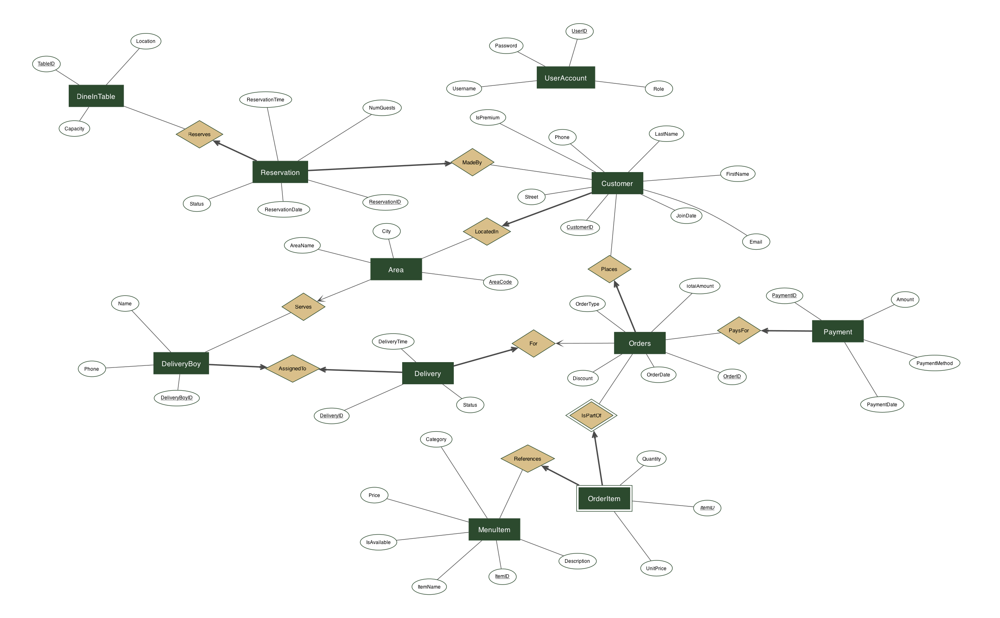

# Design & Implementation

This document covers the data model, schema, and SQL behind the Restaurant Management Database System.

---

## 1. Domain Overview

The system models a restaurant that supports both in-house dining and remote ordering (online and phone). It tracks:

- A menu catalog of food and beverage items across multiple cuisine categories
- Customer records with a premium-status flag used for discount eligibility
- Orders across three channels — Dine-In, Online, and Phone — along with the individual line items in each
- Deliveries, assigned to delivery personnel responsible for specific area codes
- Dine-in table reservations
- Payment transactions across cash, credit card, debit card, and online methods

---

## 2. Entities and Relationships

The system is built around ten business entities plus a table for application user accounts and roles:

| Entity | Purpose |
|---|---|
| **Area** | Geographic delivery zones, identified by area code |
| **Customer** | Patrons with contact info, join date, and premium flag |
| **MenuItem** | Menu catalog with name, cuisine category, price, and availability |
| **DineInTable** | Physical tables with seating capacity and location |
| **DeliveryBoy** | Delivery personnel, each assigned to exactly one area |
| **Orders** | A customer's order, recording date, type, total, and discount |
| **OrderItem** | Line items linking orders to menu items (weak entity) |
| **Delivery** | Delivery record for online/phone orders |
| **Payment** | Payment transactions, one per order |
| **Reservation** | Dine-in table reservations with date, time, and party size |
| **UserAccount** | Application user accounts and roles, for access control |

Key design decisions:

- **One-to-one between DeliveryBoy and Area.** A `UNIQUE` constraint on `DeliveryBoy.AreaCode` enforces the rule that each area has at most one delivery driver, making driver assignment deterministic.
- **OrderItem as a weak entity.** Orders and menu items have a many-to-many relationship, so `OrderItem` resolves it with a composite primary key `(OrderID, ItemID)` plus `Quantity` and `UnitPrice` attributes. Deletion of an order cascades to its line items so no orphans can exist.
- **`UnitPrice` as a historical snapshot.** `OrderItem.UnitPrice` is captured at order time, not looked up from `MenuItem.Price`. When the restaurant raises a price, historical orders preserve what the customer was actually charged.
- **Participation constraints.** Every order must belong to a registered customer, every payment must belong to an order, and every delivery must be assigned to a delivery driver — enforced by `NOT NULL` foreign keys.
- **`Orders` is named in the plural** to avoid colliding with the SQL reserved word `ORDER` (as in `ORDER BY`), which is invalid as a bare table name in most engines.
- **`UserAccount` is an application-layer table.** It models system user accounts and their roles for access control, with no foreign-key relationships to the operational entities — it is intentionally outside the restaurant business domain. (Passwords are stored in plaintext for this demo; a production system would store salted hashes.)
- **`MenuItem.Category` uses cuisine types** (`American`, `Asian`, `Mexican`, `Italian`, `Beverage`) rather than a coarse food/beverage split, enabling category-level filtering, per-cuisine reporting, and keyword search.

### ERD



---

## 3. Relational Schema

The eleven tables use `INT` primary keys, `VARCHAR` for free-text fields, `DECIMAL(10,2)` for monetary values, and `DATE` / `TIMESTAMP` / `TIME` for temporal fields. Every constrained text column (order type, payment method, delivery status, menu category) uses a `CHECK` constraint against an explicit domain to prevent bad data at the storage layer.

```
Area(AreaCode PK, AreaName, City)
Customer(CustomerID PK, FirstName, LastName, Phone, Email UNIQUE, Street,
         AreaCode FK -> Area, JoinDate, IsPremium)
MenuItem(ItemID PK, ItemName,
         Category ∈ {American, Asian, Mexican, Italian, Beverage},
         Price > 0, IsAvailable)
DineInTable(TableID PK, Capacity > 0, Location)
DeliveryBoy(DeliveryBoyID PK, Name, Phone, AreaCode FK UNIQUE)
Orders(OrderID PK, CustomerID FK, OrderDate,
       OrderType ∈ {Dine-In, Online, Phone}, TotalAmount, Discount)
OrderItem(OrderID, ItemID, Quantity > 0, UnitPrice > 0)  PK(OrderID, ItemID)
Delivery(DeliveryID PK, OrderID FK UNIQUE, DeliveryBoyID FK, DeliveryTime,
         Status ∈ {Pending, In Transit, Delivered, Cancelled})
Payment(PaymentID PK, OrderID FK UNIQUE, Amount > 0,
        PaymentMethod ∈ {Cash, Credit Card, Debit Card, Online}, PaymentDate)
Reservation(ReservationID PK, CustomerID FK, TableID FK,
            ReservationDate, ReservationTime, NumGuests > 0,
            Status ∈ {Confirmed, Cancelled, Completed})
UserAccount(UserID PK, Username UNIQUE, Password, Role)
```

The full DDL with all foreign keys, `NOT NULL`, and `CHECK` constraints lives in [`sql/schema.sql`](../sql/schema.sql).

### Normalization (BCNF)

All eleven tables are in BCNF: every non-trivial functional dependency has a superkey on its left-hand side, so there are no partial or transitive dependencies. The dependencies below follow from the intended meaning of the data, not from any particular set of rows.

For most tables this is immediate. The primary key determines every other column, and there are no further dependencies:

| Table | Primary FD | Candidate key |
|---|---|---|
| Area | `AreaCode -> AreaName, City` | `{AreaCode}` |
| Customer | `CustomerID -> (everything else)` | `{CustomerID}` |
| MenuItem | `ItemID -> ItemName, Category, Price, IsAvailable` | `{ItemID}` |
| DineInTable | `TableID -> Capacity, Location` | `{TableID}` |
| Orders | `OrderID -> CustomerID, OrderDate, OrderType, TotalAmount, Discount` | `{OrderID}` |

A few tables carry a second candidate key, or a dependency worth noting:

- **DeliveryBoy** has two candidate keys, `{DeliveryBoyID}` and `{AreaCode}`. The `UNIQUE` constraint on `AreaCode` makes its relationship to Area one-to-one, so either attribute functionally determines the rest of the row.
- **Delivery** and **Payment** each have `{OrderID}` as a candidate key in addition to their own ID, since an order has at most one delivery and one payment.
- **Reservation** also keys on `{TableID, ReservationDate, ReservationTime}`, which enforces that a table cannot be booked twice at the same date and time.
- **UserAccount** keys on `{Username}` as well as `{UserID}`, since `Username` is declared `UNIQUE`.
- **OrderItem** uses the composite key `{OrderID, ItemID}`. A natural candidate dependency, `ItemID -> UnitPrice`, does not hold: `UnitPrice` records the price at the time of the order, so the same item may carry different unit prices across orders.

Two cases resemble violations but are not. `AreaCode -> City` would be a transitive dependency in Customer, but Customer does not store `City` at all; it lives only in Area and is reached through the `AreaCode` foreign key. `Orders.TotalAmount` is a stored copy of `SUM(Quantity * UnitPrice)` (the gross line-item subtotal), kept to avoid recomputing it on every read; the discount is applied separately, with the net amount recorded in `Payment.Amount`. `OrderID` still determines `TotalAmount`, so BCNF holds, and keeping it consistent is an application-layer concern rather than a normalization one.

Because every table is already in BCNF (which is stricter than 3NF), the schema is also in 3NF, 2NF, and 1NF, and no decomposition is required.

---

## 4. Views

Two views encapsulate frequently-needed joins. Full definitions live in [`sql/views.sql`](../sql/views.sql).

### CustomerOrderSummary

One row per customer with total orders, total spending, and total discounts received. Uses a `LEFT JOIN` so customers with zero orders still appear with counts of zero.

```sql
CREATE VIEW CustomerOrderSummary AS
SELECT
    C.CustomerID, C.FirstName, C.LastName, C.IsPremium,
    COUNT(O.OrderID)                  AS TotalOrders,
    COALESCE(SUM(O.TotalAmount), 0)   AS TotalSpent,
    COALESCE(SUM(O.Discount), 0)      AS TotalDiscount
FROM Customer C
LEFT JOIN Orders O ON C.CustomerID = O.CustomerID
GROUP BY C.CustomerID, C.FirstName, C.LastName, C.IsPremium;
```

Customer-level aggregates such as `MAX`/`MIN`/`AVG` of `TotalSpent` become one-liners on top of this view.


### OrderDetails

Flattens the three-way join between `Orders`, `OrderItem`, and `MenuItem` into a single row per line item, with a computed `LineTotal` column.

```sql
CREATE VIEW OrderDetails AS
SELECT
    O.OrderID, O.CustomerID, O.OrderDate, O.OrderType,
    M.ItemName, M.Category,
    OI.Quantity, OI.UnitPrice,
    (OI.Quantity * OI.UnitPrice) AS LineTotal
FROM Orders O
JOIN OrderItem OI ON O.OrderID = OI.OrderID
JOIN MenuItem  M  ON OI.ItemID  = M.ItemID;
```

Simplifies item-level sales reporting.


---

## 5. Triggers

Three triggers enforce cross-table business rules that can't be expressed with simple `CHECK` constraints. Full definitions live in [`sql/triggers.sql`](../sql/triggers.sql).

### Block deliveries for Dine-In orders — `BEFORE INSERT ON Delivery`

```sql
CREATE OR REPLACE FUNCTION fn_prevent_dinein_delivery()
RETURNS TRIGGER AS $$
BEGIN
    IF EXISTS (
        SELECT 1 FROM Orders O
        WHERE O.OrderID = NEW.OrderID AND O.OrderType = 'Dine-In'
    ) THEN
        RAISE EXCEPTION 'Cannot create a delivery for a Dine-In order.';
    END IF;
    RETURN NEW;
END;
$$ LANGUAGE plpgsql;
```

### Auto-promote to premium at $200 lifetime spend — `AFTER INSERT OR UPDATE ON Orders`

```sql
CREATE OR REPLACE FUNCTION fn_update_premium_status()
RETURNS TRIGGER AS $$
BEGIN
    UPDATE Customer
    SET IsPremium = 'Yes'
    WHERE CustomerID = NEW.CustomerID
      AND IsPremium = 'No'
      AND (
          SELECT SUM(O.TotalAmount) FROM Orders O
          WHERE O.CustomerID = NEW.CustomerID
      ) >= 200;
    RETURN NEW;
END;
$$ LANGUAGE plpgsql;
```

Firing on both `INSERT` and `UPDATE` means a new order that crosses $200 promotes the customer immediately. Keying the update on `NEW.CustomerID` re-checks only the customer whose order changed (rather than re-scanning every customer), and the `AND IsPremium = 'No'` guard avoids redundant writes when they are already premium. Promotion is one-way by design: cumulative lifetime spend does not decrease under normal use, so customers are never demoted.

`IsPremium` has two sources. The trigger sets it automatically once a customer's lifetime spend reaches $200, and staff can also set it manually (for example, to comp a frequent customer or apply a promotion not tied to spend). Because the trigger only ever grants premium, it does not override a manually set flag, and a customer who reaches the threshold keeps the status even if a later order is reduced. The $200 rule is therefore an automatic floor for premium status, not the only path to it.

### Block deletion of customers with orders — `BEFORE DELETE ON Customer`

```sql
CREATE OR REPLACE FUNCTION fn_prevent_customer_delete()
RETURNS TRIGGER AS $$
BEGIN
    IF EXISTS (
        SELECT 1 FROM Orders O WHERE O.CustomerID = OLD.CustomerID
    ) THEN
        RAISE EXCEPTION 'Cannot delete a customer who has existing orders.';
    END IF;
    RETURN OLD;
END;
$$ LANGUAGE plpgsql;
```

Preserves order history and prevents accidental referential data loss.

---

## 6. Sample Queries

Ten representative queries against the schema, ranging from simple filters to relational division. All ten live in [`sql/queries.sql`](../sql/queries.sql).

### Customers who placed both online and phone orders — set intersection

```sql
SELECT C.FirstName, C.LastName
FROM Customer C
JOIN Orders O ON C.CustomerID = O.CustomerID
WHERE O.OrderType = 'Online'
INTERSECT
SELECT C.FirstName, C.LastName
FROM Customer C
JOIN Orders O ON C.CustomerID = O.CustomerID
WHERE O.OrderType = 'Phone';
```

### Customers who have ordered every beverage on the menu — relational division

```sql
SELECT C.FirstName, C.LastName
FROM Customer C
WHERE NOT EXISTS (
    SELECT M.ItemID FROM MenuItem M
    WHERE M.Category = 'Beverage'
    EXCEPT
    SELECT OI.ItemID
    FROM Orders O
    JOIN OrderItem OI ON O.OrderID = OI.OrderID
    WHERE O.CustomerID = C.CustomerID
);
```

Implements relational division via `NOT EXISTS` + `EXCEPT` — finds customers for whom the set of beverage items *not yet ordered* is empty.

### Customers and drivers per delivery — four-way join

```sql
SELECT C.FirstName, C.LastName,
       DB.Name AS DeliveryBoyName,
       D.DeliveryTime, D.Status
FROM Customer    C
JOIN Orders      O  ON C.CustomerID    = O.CustomerID
JOIN Delivery    D  ON O.OrderID       = D.OrderID
JOIN DeliveryBoy DB ON D.DeliveryBoyID = DB.DeliveryBoyID;
```

### Total discount by customer — aggregation with filter

```sql
SELECT C.FirstName, C.LastName,
       COUNT(O.OrderID) AS DiscountedOrders,
       SUM(O.Discount)  AS TotalDiscount
FROM Customer C
JOIN Orders   O ON C.CustomerID = O.CustomerID
WHERE O.Discount > 0
GROUP BY C.CustomerID, C.FirstName, C.LastName
ORDER BY TotalDiscount DESC;
```

### Customers who have never placed an order — anti-join via `NOT EXISTS`

```sql
SELECT C.FirstName, C.LastName
FROM Customer C
WHERE NOT EXISTS (
    SELECT *
    FROM Orders O
    WHERE O.CustomerID = C.CustomerID
);
```

The remaining five queries — premium customers, dine-in order details by customer, line items for a specific order, reservations by table capacity, and distinct items ordered by premium customers — are in `sql/queries.sql`.

---

## 7. Data Source

Menu items (IDs 101–132) come from the [Maven Analytics Restaurant Orders dataset](https://github.com/zainhaidar16/Restaurant-Order-Analysis). Beverage items (IDs 133–138) and all other seed data were generated to exercise the schema.

The bundled [`sql/seed.sql`](../sql/seed.sql) populates all eleven tables with a mix of real and synthetic data:

| Table | Rows | Notes |
|---|---|---|
| UserAccount | 3 | Admin, Staff, Manager accounts with roles |
| Area | 8 | Area codes 10001–10008 |
| Customer | 15 | Mix of premium and non-premium |
| MenuItem | 38 | 32 real items (Maven Analytics) + 6 beverages |
| DineInTable | 8 | Various capacities and locations |
| DeliveryBoy | 5 | Areas 10006–10008 intentionally have no driver |
| Orders | 27 | Dine-In, Online, and Phone |
| OrderItem | 96 | Line items linking orders to menu items |
| Delivery | 10 | Online/Phone orders only |
| Payment | 27 | One per order |
| Reservation | 8 | Various statuses |

Several rows are constructed to exercise specific queries — for example, Customer 13 has no orders (for the anti-join), Customer 1 has ordered every beverage (for the relational-division query), and areas 10006–10008 have no delivery driver. Customer 7's orders push lifetime spend past $200, so the premium-promotion trigger fires while the seed loads.
